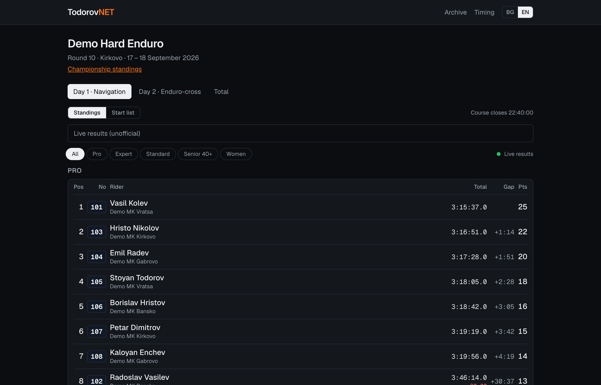
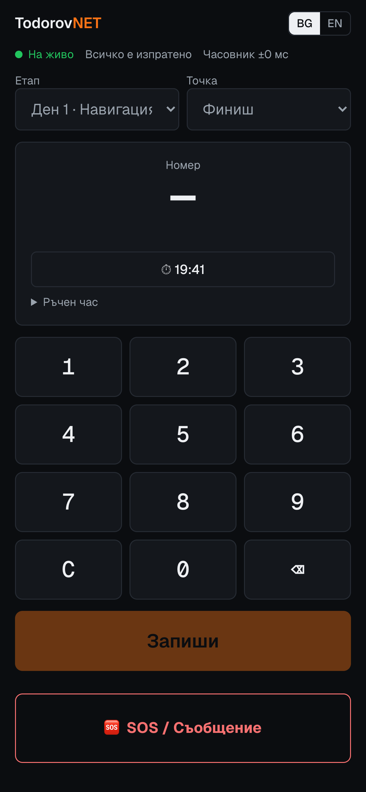
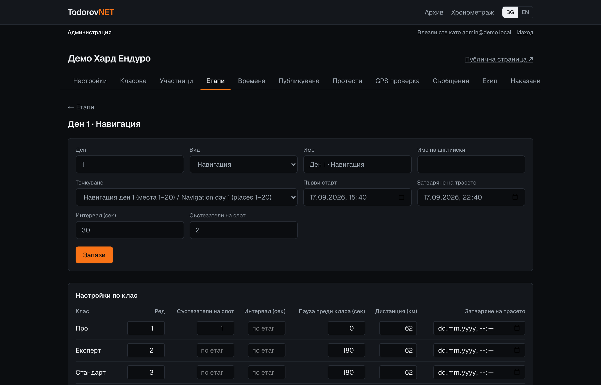
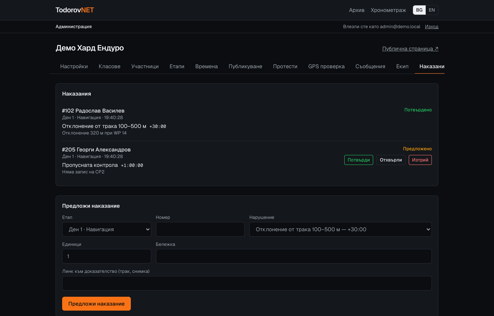

<div align="center">

# 🏁 TodorovNET

**Live timing and results for hard enduro, built for race day in the mountains.**

Official-grade timing for the Bulgarian Hard Enduro Championship (BG-X): offline-first phones on the course,
live standings for the crowd, GPS penalty checks, protests and signed-off results, in Bulgarian and English.

[](https://nextjs.org/)
[](https://react.dev/)
[](https://www.typescriptlang.org/)
[](https://supabase.com/)
[](https://tailwindcss.com/)
[](https://todorovnet.vercel.app)
[](LICENSE)

**[Live site](https://todorovnet.vercel.app)** · **[BG-X rules in code](docs/bgx-rules.md)** · **[Officials' manual](https://todorovnet.vercel.app/en/guide)** (sign-in required)

</div>

<p align="center">
  
</p>

---

## Why it exists

A hard enduro stage runs for hours across mountains with patchy coverage. Timekeepers sit at checkpoints
with a phone, GPS judges review hundreds of tracks after the finish, and hundreds of people refresh the
standings on the way down. The results have to be right, provably right, and published the way the
rulebook says.

TodorovNET replaces paper sheets and manual spreadsheets with one system that keeps working when the
signal drops, never loses a record, and derives every standing from the raw facts recorded on the course.

## Features

### On the course

- **Offline-first timing app.** Records go to an on-device queue (IndexedDB) and sync on their own when
  there is signal. The app reopens with no coverage through a service worker.
- **Server-synced clock.** Every time is corrected by the measured offset to the server clock, not the
  phone's own time.
- **Can't double-count.** Every record carries a client-generated UUID, so resends after a timeout are
  stored exactly once. Duplicates at the same point are rejected and shown.
- **Paper backup.** Timekeepers can enter a time by hand from a paper sheet, or void a mistake in two steps.
- **Enduro-cross heats.** Start a heat and raise a **red flag** from the phone.
- **SOS and course messages.** They carry the race number and the phone's location, and reach the
  organizer and the jury live with an alarm.

### For the public

- **Live standings** per stage and class, with gaps, penalties and championship points.
- **Built for crowds.** Updates arrive through realtime pushes. When the connection limit is reached,
  pages switch to polling an edge-cached endpoint, so the database load stays flat.
- **Start lists, season standings (riders and teams), rider profiles and a results archive.**
- **Bulgarian and English everywhere**, including official Bulgarian transliteration of names.
- **PDFs** of start lists, results and season standings, rendered from the frozen publication.

### For organizers and the jury

- **Event setup.** Classes, entries (Excel/CSV import, including Windows-1251 files), stages, checkpoints,
  per-class start settings and generated start lists.
- **Eligibility checks** for age, licence, club and registered race number.
- **GPS track check** in the browser. It compares a rider's GPX with the official track, finds deviations,
  signal gaps and missed waypoints, and proposes the rulebook penalty with a map as evidence.
- **Penalties with review.** GPS judges propose, the jury confirms. Statuses like DNF and DSQ are supported.
- **Protests** with the fee, deadlines and written decisions.
- **Publishing.** Provisional results are frozen into numbered versions. Only the jury chair can declare
  results official.
- **Enduro-cross formats.** Qualifying groups A/B, a top-12 finals grid, and red flag "count or restart".
- **Roles per event:** organizer, timekeeper, GPS judge, jury and jury chair, enforced by the database.
- **One door for officials** at `/[lang]/staff`: sign in, then admin, timing and the manual; officials
  change their own password there.
- **Officials' manual** at `/[lang]/guide` and as a printable PDF (`/api/pdf/manual`): chapters per job,
  a role permission table, a race-day checklist and troubleshooting. Riders never see it: it needs an account.

<table>
  <tr>
    <td width="30%"></td>
    <td width="70%">
      <br><br>
      
    </td>
  </tr>
</table>

## How it works

```
 Phones on the course                 Supabase (Postgres 17, EU)                 Everyone else
 ─────────────────────                ───────────────────────────                ─────────────
 IndexedDB queue  ── insert ──▶  raw facts: passings, laps,         ──▶  SQL views: navigation,
 client_id UUID                  penalties, statuses, sessions             enduro-cross, round,
 clock offset                    (void, never delete · audit log)          season, team standings
                                          │                                        │
                                  Row Level Security                  /api/live (edge-cached 5 s)
                                  per event and role                  realtime "something changed"
                                                                                   │
                                                                  Next.js on Vercel (fra1) ──▶ browser
```

A few decisions shape the whole codebase:

- **Facts in, results derived.** The database stores only what happened on the course. Positions, gaps,
  points, drop-worst-round and team standings are SQL views, so fixing a fact fixes every result built
  from it.
- **Nothing is deleted.** Records are voided with a reason, and every change lands in an audit log with
  its author and time. The jury can always see what changed.
- **Publications are frozen.** Publishing stores a snapshot with a version number. PDFs are rendered
  from the snapshot, not from live data.
- **The database is the authority.** Access rules live in Postgres Row Level Security and guarded
  functions, not only in the UI.
- **The rulebook is the spec.** Points scales, penalty brackets, course close, tie-breaks and protest
  windows follow the BG-X rules, documented in [`docs/bgx-rules.md`](docs/bgx-rules.md) and asserted in
  SQL tests.

## Tech stack

| Layer | Technology |
|---|---|
| App | Next.js 16 (App Router, server actions), React 19, TypeScript |
| Styling | Tailwind CSS 4 |
| Database and auth | Supabase: Postgres 17, Row Level Security, Auth, Realtime, Storage |
| Offline | Service worker, IndexedDB (`idb`) |
| Documents | `@react-pdf/renderer` with Noto Sans (Cyrillic and Latin) |
| Imports | `read-excel-file`, `papaparse` |
| Hosting | Vercel (Frankfurt) with a daily keep-alive cron |
| Testing | SQL scenario tests, Node test runner, Puppeteer end-to-end browser tests |

## Getting started

**Requirements:** Node.js 20+, Docker Desktop, Google Chrome (only for the browser tests).

```bash
git clone https://github.com/Narcoswiu/TodorovNet.git
cd TodorovNet
npm install

# Local Supabase in Docker: database, auth, storage, realtime
npx supabase start
npx supabase db reset          # schema + BG-X reference data + a demo event

cp .env.example .env.local     # fill in the URL and publishable key from `npx supabase status`
npm run dev                    # http://localhost:3000
```

The demo seed signs in with these local-only accounts (password `demo-todorovnet`):

| Email | Role |
|---|---|
| `admin@demo.local` | Super admin |
| `timer@demo.local` | Timekeeper |
| `gps@demo.local` | GPS judge |
| `jury@demo.local` | Jury and jury chair |

## Testing

| Command | What it checks |
|---|---|
| `npm run typecheck` | TypeScript, including generated route types |
| `npm run lint` | ESLint |
| `npm run test:unit` | GPS analysis: deviation, signal gaps, missed waypoints |
| `npm run db:test` | SQL scenarios: results, points, penalties, publications, permissions (runs in a rolled-back transaction) |
| `npm run e2e` | Timing API end to end, including realtime delivery |
| `npm run test:browser` | 45 real-browser steps: admin panel, imports, photo upload, GPS check, protests, publishing, staff-only access, and the timing app online, offline and reopened without a connection |

Run the browser tests against a production build, because offline reopening needs the service worker:

```bash
npx supabase db reset && npm run build && npx next start --port 3001
APP=http://localhost:3001 npm run test:browser
```

## Deployment

1. Create a Supabase project in an EU region and apply the schema with `npx supabase link` and
   `npx supabase db push`. The demo seed is local only.
2. In Supabase Auth, disable public sign-ups, set the Site URL, and create the first user. Promote that
   user with `update public.profiles set is_super_admin = true where id = …`.
3. Create a Vercel project and set these environment variables:

   | Variable | Value |
   |---|---|
   | `NEXT_PUBLIC_SUPABASE_URL` | Project URL |
   | `NEXT_PUBLIC_SUPABASE_PUBLISHABLE_KEY` | Publishable key |
   | `NEXT_PUBLIC_OPERATOR_NAME` | Shown on the privacy page |
   | `NEXT_PUBLIC_CONTACT_EMAIL` | Data-protection contact |

4. Deploy with `npx vercel deploy --prod`. `vercel.json` pins functions to Frankfurt and schedules the
   daily keep-alive.

## Project structure

```
src/
  app/[lang]/        Public pages (bg/en): events, seasons, riders, archive, guide, privacy, login
  app/[lang]/admin/  Admin panel, one tab per task
  app/[lang]/t/      Offline-first timing app
  app/api/           Live standings, PDFs (results, season, start list, manual), locale switch, keep-alive
  components/        UI: results tables, timing app, admin forms
  i18n/              Dictionaries (Bulgarian is the source of truth), the manual text and transliteration
  lib/               Auth, results queries, GPS analysis, PDF documents, offline queue
supabase/
  migrations/        Schema, BG-X reference data, results views, functions, policies
  seed.sql           Local demo event
  tests/             SQL scenarios and end-to-end timing checks
tests/browser/       Puppeteer tests against a running app
docs/                BG-X rules reference and screenshots
```

---

<details>
<summary><b>🇧🇬 На български</b></summary>

**TodorovNET** е система за хронометраж и класиране на хард ендуро състезания по правилата на BG-X.

- **Хронометраж от телефона.** Работи и без покритие: записите се пазят в телефона и се изпращат сами.
  Има ръчен час, анулиране, червен флаг и SOS.
- **Класиране на живо.** По етапи, класове и сезон, с точки, разлики и наказания. Издържа много
  зрители едновременно.
- **GPS проверка на траковете.** Системата сама предлага наказание по правилника, с карта като доказателство.
- **Жури.** Потвърждава наказанията, решава протестите и публикува резултатите. Официалните резултати
  се обявяват от председателя на журито.
- **PDF документи** на стартовите списъци, резултатите и генералното класиране.
- **Всичко е на български и английски.**

Сайт: **[todorovnet.vercel.app](https://todorovnet.vercel.app)** · Ръководство за съдии:
**[todorovnet.vercel.app/bg/guide](https://todorovnet.vercel.app/bg/guide)**

</details>

## License

[MIT](LICENSE) © 2026 Nikolai Todorov
